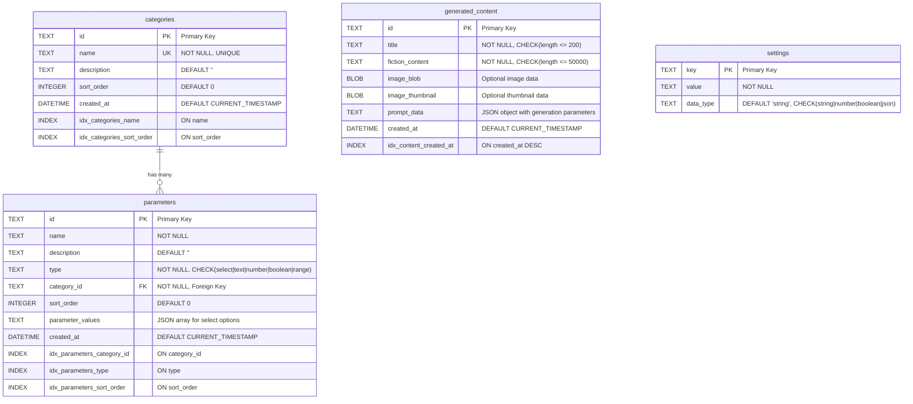

# SpecGen Server

[](https://github.com/gv-sh/specgen-server)

A Node.js/Express API for generating speculative fiction stories using AI. Manages fiction categories and their parameters, and provides endpoints for generating content through OpenAI integration.

## Project Structure

SpecGen consists of three modules:

- **Server (This Repository)**: Backend API
- **Admin UI**: Interface for managing categories and parameters
- **User UI**: Interface for generating stories

## Features

- RESTful API for managing fiction categories and parameters
- OpenAI integration for fiction and image generation
- Configurable AI settings (models, parameters, prompts)
- Swagger API documentation
- JSON file-based data storage
- Parameter validation and type handling

## Quick Start

### Prerequisites

- Node.js (v14+)
- npm
- OpenAI API key

### Installation

1. Clone the repository
2. Install dependencies:

   ```bash
   npm install
   ```

3. Create a `.env` file:

  ```text
   OPENAI_API_KEY=your_key_here
   PORT=3000
   NODE_ENV=development
   ```

### Starting the Server

```bash
# Development mode with auto-restart
npm run dev

# Production mode
npm start
```

### Initialize Sample Data (Optional)

```bash
npm run init-db
```

## API Documentation

Access the Swagger UI documentation at `http://localhost:3000/api-docs` when the server is running.

### API Specification

You can generate a static API specification file using:
```bash
npm run generate-api-spec
```

This will create an `api-spec.json` file in the root directory, which can be used by frontend applications for:
- Type generation (with tools like openapi-typescript)
- API client generation
- Mock server setup
- Documentation

### Core Endpoints

#### Categories

- `GET /api/categories` - List all categories
- `POST /api/categories` - Create a category
- `GET /api/categories/:id` - Get a category
- `PUT /api/categories/:id` - Update a category
- `DELETE /api/categories/:id` - Delete a category

#### Parameters

- `GET /api/parameters` - List all parameters
- `POST /api/parameters` - Create a parameter
- `GET /api/parameters/:id` - Get a parameter
- `PUT /api/parameters/:id` - Update a parameter
- `DELETE /api/parameters/:id` - Delete a parameter

#### Generation

- `POST /api/generate` - Generate fiction based on parameters

#### Settings

- `GET /api/settings` - Get all application settings
- `PUT /api/settings` - Update application settings
- `POST /api/settings/reset` - Reset settings to defaults

#### Database Management

- `GET /api/database/download` - Get database content
- `POST /api/database/restore` - Restore database from file
- `POST /api/database/reset` - Reset database to empty state

#### Content

- `GET /api/content` - List all generated content
- `GET /api/content/:id` - Get a specific generated content
- `PUT /api/content/:id` - Update generated content
- `DELETE /api/content/:id` - Delete generated content

## Parameter Types

The system supports various parameter types for story configuration:

- **Dropdown**: Selection from 4-12 values
- **Slider**: Numeric value with min/max range
- **Toggle Switch**: Boolean choice (yes/no)
- **Radio Buttons**: Mutually exclusive options
- **Checkbox**: Multiple selectable options

## Settings Configuration

The application includes configurable settings for AI generation:

### AI Models

- Fiction generation model (default: gpt-4o-mini)
- Image generation model (default: dall-e-3)

### Fiction Parameters

- Temperature (default: 0.8)
- Maximum tokens (default: 1000)
- Default story length (default: 500 words)
- System prompt for AI

### Image Parameters

- Image size (default: 1024x1024)
- Image quality (default: standard)
- Default prompt suffix

### Default Settings

- Default content type (fiction or image)

## Development

### Running Tests

```bash
npm test
```

### Linting

```bash
npm run lint
```

## Architecture

- **Controllers**: Handle HTTP requests and responses
- **Services**: Provide core business logic
- **Routes**: Define API endpoints
- **Middleware**: Process requests
- **Data**: JSON-based storage

## Database ER Diagram

This section contains the Entity-Relationship diagram for the SpecGen minimal database schema.

### Entity-Relationship Diagram



### Table Descriptions

#### categories
Fiction categories and genres that define the types of content that can be generated.
- **Purpose**: Organize parameters into logical groups
- **Key Features**: Name uniqueness, sortable order
- **Examples**: "Science Fiction", "Fantasy", "Mystery"

#### parameters
Configuration parameters for content generation within each category.
- **Purpose**: Define user inputs for story generation
- **Key Features**: Type validation, JSON values for select options
- **Types**: select, text, number, boolean, range
- **Examples**: "Technology Level", "Magic System", "Story Length"

#### generated_content
All user-generated stories and images with metadata.
- **Purpose**: Store final generated content
- **Key Features**: Content length validation, optional images, prompt tracking
- **Storage**: Fiction text + optional image BLOBs + generation metadata

#### settings
Application configuration and system settings.
- **Purpose**: Store configurable application parameters
- **Key Features**: Type-safe value storage, flexible data types
- **Examples**: app_version, max_generations_per_session, enable_image_generation

### Relationships

1. **categories ↔ parameters**: One-to-Many
   - Each category can have multiple parameters
   - Each parameter belongs to exactly one category
   - Cascade delete: removing a category removes all its parameters

2. **generated_content**: Standalone table
   - No direct foreign key relationships
   - Contains JSON prompt_data that may reference category/parameter IDs
   - Allows for flexible content storage without rigid constraints

3. **settings**: Standalone table
   - Global application configuration
   - No relationships with other entities

### Key Design Decisions

1. **Minimal Schema**: Reduced from 163 to 63 lines (70% reduction)
2. **Removed Analytics**: No user tracking or session management
3. **Simplified Parameters**: Single table instead of complex parameter configurations
4. **Flexible Content Storage**: JSON-based prompt data instead of normalized relationships
5. **Essential Indexes**: Only performance-critical indexes maintained
6. **Type Safety**: CHECK constraints for enum-like fields

## Deployment

For deployment on a Digital Ocean Ubuntu droplet, use the provided deployment scripts in the `deploy` directory:

1. `deploy.sh`: Main deployment script for server setup and application installation
2. `nginx-specgen.conf`: Nginx configuration for hosting all components
3. `ecosystem.config.js`: PM2 configuration for process management

See the [deployment guide](./deploy/README.md) for detailed instructions.

## License

ISC
