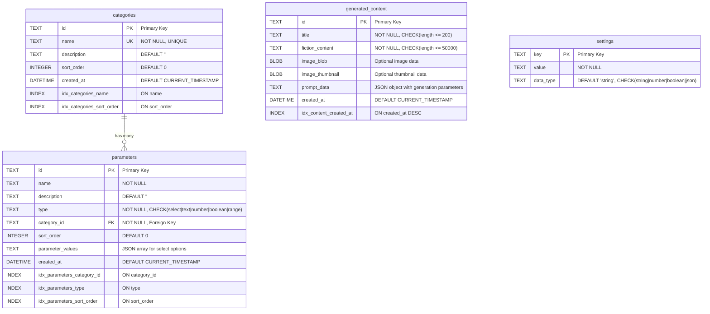

# SpecGen Database ER Diagram

This document contains the Entity-Relationship diagram for the SpecGen minimal database schema.

## Entity-Relationship Diagram

## Table Descriptions

### categories
Fiction categories and genres that define the types of content that can be generated.
- **Purpose**: Organize parameters into logical groups
- **Key Features**: Name uniqueness, sortable order
- **Examples**: "Science Fiction", "Fantasy", "Mystery"

### parameters  
Configuration parameters for content generation within each category.
- **Purpose**: Define user inputs for story generation
- **Key Features**: Type validation, JSON values for select options
- **Types**: select, text, number, boolean, range
- **Examples**: "Technology Level", "Magic System", "Story Length"

### generated_content
All user-generated stories and images with metadata.
- **Purpose**: Store final generated content
- **Key Features**: Content length validation, optional images, prompt tracking
- **Storage**: Fiction text + optional image BLOBs + generation metadata

### settings
Application configuration and system settings.
- **Purpose**: Store configurable application parameters
- **Key Features**: Type-safe value storage, flexible data types
- **Examples**: app_version, max_generations_per_session, enable_image_generation

## Relationships

1. **categories ↔ parameters**: One-to-Many
   - Each category can have multiple parameters
   - Each parameter belongs to exactly one category
   - Cascade delete: removing a category removes all its parameters

2. **generated_content**: Standalone table
   - No direct foreign key relationships
   - Contains JSON prompt_data that may reference category/parameter IDs
   - Allows for flexible content storage without rigid constraints

3. **settings**: Standalone table
   - Global application configuration
   - No relationships with other entities

## Key Design Decisions

1. **Minimal Schema**: Reduced from 163 to 63 lines (70% reduction)
2. **Removed Analytics**: No user tracking or session management
3. **Simplified Parameters**: Single table instead of complex parameter configurations
4. **Flexible Content Storage**: JSON-based prompt data instead of normalized relationships
5. **Essential Indexes**: Only performance-critical indexes maintained
6. **Type Safety**: CHECK constraints for enum-like fields